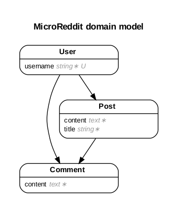

# Micro Reddit

This project involves the creation of the **data model** for a website, that approximates the functionality of [Reddit](https://www.reddit.com/). Once the models are generated and the migrations are ran, the data model can be tested in the Rails console (`rails console`). No view pages or UI were generated at this point of time.

## Project Participants

- Keshav Chakravarthy
- [Edward Iga](github.com/igakigongo)

## Notes

### Data Model

1. Users

    - Username 
        - required
        - length 8..50 
        - unique

    - has_many posts
    - has_many comments

2. Posts

    - title
        - required
        - max length 255
    - content (text)
        - required
        - max length 1000
    - belongs_to user
    - has_many comments

3. Comments
    - content
        - required
        - max length 1000
    - belongs_to post
    - belongs_to user

### Entity Relationship Diagram

### Setup 

1. Clone this repo.
2. Run the migration: `rails db:migrate`
3. Open the console: `rails console`
4. Try playing with the `User`, `Post` and `Comment` objects that constitute this project's data model.